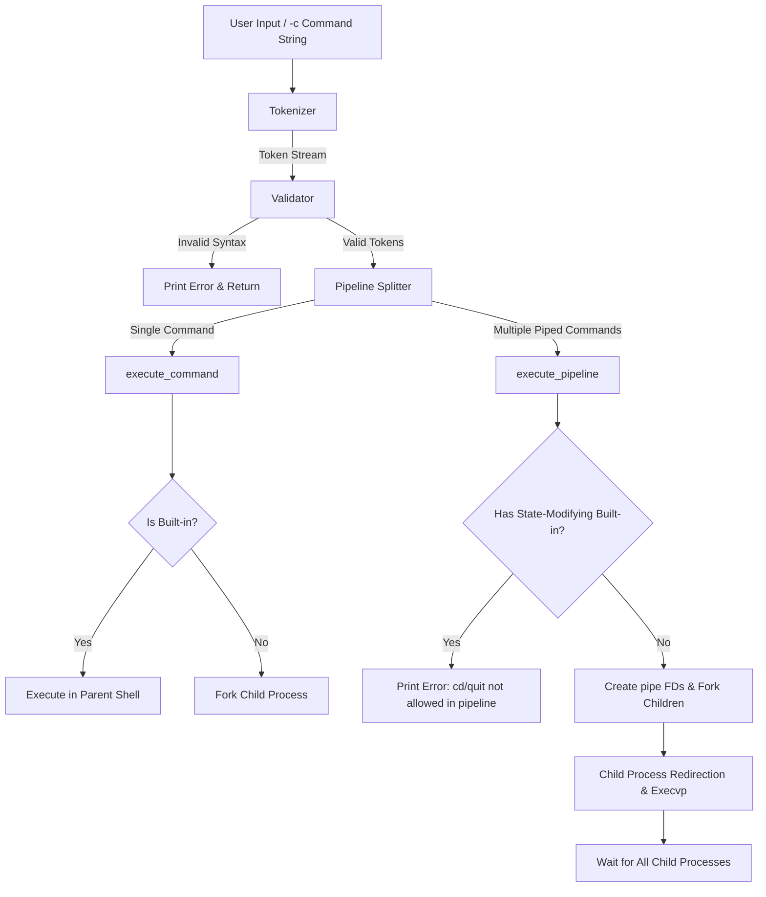

# 🐚 UNIX Command Interpreter

Welcome! This is a complete, educational, and production-quality implementation of a UNIX Command Interpreter written in C11. It compiles warning-free with strict compiler flags (`-Wall -Wextra -pedantic -std=c11`) and is designed to be highly readable and easy for students to study.

---

## 🎨 System Design & Workflow

Below is the workflow diagram of how this shell reads, tokenizes, validates, and executes user commands.

### 1. High-Level Flowchart (Mermaid)



### 2. Multi-Stage Pipeline Mechanism (`execute_pipeline`)

When you run a command like `cat input.txt | grep "apple" | wc -l > output.txt`, the shell constructs the following process tree and file descriptor bindings:

```
                  ┌──────────────────────┐
                  │     Parent Shell     │
                  └──────────┬───────────┘
              ┌──────────────┼──────────────┐
            Fork           Fork           Fork
              ▼              ▼              ▼
       ┌──────────┐   ┌──────────┐   ┌──────────┐
       │ Child 1  │   │ Child 2  │   │ Child 3  │
       │ (cat)    │   │ (grep)   │   │ (wc)     │
       └────┬─────┘   └────┬─────┘   └────┬─────┘
            │              │              │
    [stdin = input.txt]    │      [stdout = output.txt]
            │              │              │
            ▼              ▼              ▼
       pipes_fds[1] ──► pipes_fds[0]
                      pipes_fds[3] ──► pipes_fds[2]
       (pipe 1 write)   (pipe 1 read)  (pipe 2 write) (pipe 2 read)
```

---

## 📂 File Structure

The project code is divided into modular, single-responsibility files:

- **`Makefile`**: Compilation orchestrator containing targets for compiling, running, cleaning, and debugging.
- **`include/`** (Header Files):
  - **`shell.h`**: Standard system headers, project limits, and global variables.
  - **`command.h`**: The `Command` struct definition containing `argv`, `argc`, and file redirections.
  - **`tokenizer.h`**: Lexical analyzer types (`Token`, `TokenType`).
  - **`parser.h`**: Parsing prototypes (`build_command`, `parse_tokens`).
  - **`execute.h`**: Main execution prototype (`execute_command`).
  - **`builtin.h`**: Built-in command structures and functions.
  - **`history.h`**: Command history buffer prototypes.
- **`src/`** (Source Code):
  - **`main.c`**: Shell prompt loop and `-c` non-interactive CLI arguments logic.
  - **`tokenizer.c`**: Lexes raw text into structured tokens.
  - **`parser.c`**: Implements token sequence validation, semicolon splits, and pipeline process setup.
  - **`execute.c`**: Spawns single child processes and redirects standard I/O streams.
  - **`builtin.c`**: Implements shell built-in actions (`cd`, `quit`, `hist`, `curPid`, `pPid`).
  - **`history.c`**: Maintains a rolling buffer of the last 10 commands using a sliding array.

---

## 🛠️ Requirements & Setup

### 📋 Prerequisites
Ensure you have a C compiler and build tools installed on your Unix/Linux machine:
- **Debian/Ubuntu**: `sudo apt install build-essential valgrind`
- **RedHat/Fedora**: `sudo dnf groupinstall "Development Tools" && sudo dnf install valgrind`

### ⚙️ Compilation

Run standard compilation targets using `make`:

```bash
# Compile the shell program (produces prog01 executable)
make

# Run the shell in interactive mode
make run

# Clean all temporary build (.o) files and binaries
make clean

# Compile with debug symbols (-g -O0) for debugger use
make debug
```

---

## 💡 Usage Examples

### 1. Running Commands Separately
Run multiple commands sequentially using `;`:
```bash
<1 user> pwd ; date ; ls
```

### 2. File Redirections
Redirect standard input (`<`) or standard output (`>`):
```bash
<2 user> ls -la > files.txt
<3 user> grep "main" < src/main.c
```

### 3. Pipeline Chains (Any number of stages)
```bash
<4 user> cat src/main.c | grep "include" | wc -l
```

### 4. Built-in Commands
- `cd <path>`: Changes the current working directory of the shell.
- `quit`: Exits the shell session.
- `hist`: Shows the last 10 commands you ran, aligned with prompt sequence numbers.
- `curPid`: Prints the current process ID of this shell.
- `pPid`: Prints the process ID of the parent terminal that spawned this shell.

### 5. Script Mode (-c Option)
Execute a command string directly from the terminal without entering the interactive loop:
```bash
./prog01 -c "ls -l | grep txt"
```

---

## 🛡️ Memory Safety & Leak Detection

We use dynamic memory allocation only when creating dynamic arrays for pipes and child process IDs. This memory is guaranteed to be cleaned up under all success and failure paths.

To run the shell under the **Valgrind memory checker**:

```bash
valgrind --leak-check=full --show-leak-kinds=all --track-origins=yes ./prog01
```
Execute commands and type `quit` to exit. You will see a leak report showing:
`All heap blocks were freed -- no leaks are possible`.
